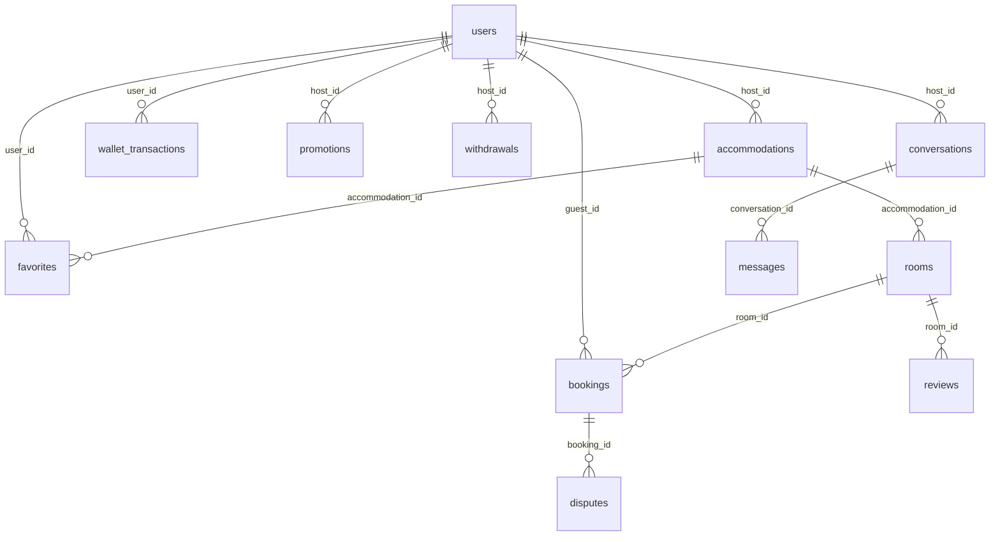

# ERD — ROVVA Homestay Platform

> Sơ đồ quan hệ thực thể sinh từ SQLAlchemy models (`backend/app/models/`).  
> Cập nhật: 10/07/2026

---

## Sơ đồ tổng quan (Mermaid)



---

## Bảng `users`

| Cột | Kiểu | Ràng buộc | Mô tả |
|-----|------|-----------|-------|
| id | INTEGER | PK | |
| full_name | VARCHAR(120) | NOT NULL | |
| email | VARCHAR(120) | UNIQUE, NOT NULL | |
| password_hash | VARCHAR(255) | | Werkzeug hash |
| phone | VARCHAR(20) | | |
| id_card | VARCHAR(20) | | |
| introduction | TEXT | | |
| gender | VARCHAR(10) | | |
| birthday | DATE | | |
| city | VARCHAR(120) | | |
| avatar | VARCHAR(255) | | Path legacy; UI dùng `avatar_url` |
| role | VARCHAR(20) | default `guest` | `guest`, `host`, `admin` |
| created_at | DATETIME | | |
| is_email_verified | BOOLEAN | default false | |
| email_verification_token | VARCHAR(255) | | |
| reset_password_token | VARCHAR(255) | | |
| reset_password_expiry | DATETIME | | |
| failed_login_attempts | INTEGER | default 0 | |
| is_locked | BOOLEAN | default false | |
| host_status | VARCHAR(20) | default `none` | `none`, `pending`, `approved`, `rejected` |
| host_document_path | VARCHAR(255) | | Giấy tờ đăng ký host |

**Quan hệ:** 1 Host → N `accommodations`, `promotions`, `withdrawals`, `conversations`

---

## Bảng `accommodations`

| Cột | Kiểu | Ràng buộc | Mô tả |
|-----|------|-----------|-------|
| id | INTEGER | PK | |
| host_id | INTEGER | FK → users.id, NOT NULL | |
| name | VARCHAR(200) | NOT NULL | |
| type | VARCHAR(50) | default Homestay | |
| city, district | VARCHAR | | |
| address | VARCHAR(500) | | |
| location | VARCHAR(200) | | |
| description | TEXT | | |
| image | VARCHAR(255) | | Legacy path |
| status | VARCHAR(20) | NOT NULL | `active`, `pending`, `paused`, `draft`, `rejected` |
| features | JSON | | Tiện ích CSLT |
| allows_pets | BOOLEAN | | |
| check_in_time | VARCHAR(10) | default 14:00 | |
| check_out_time | VARCHAR(10) | default 12:00 | |
| cancellation_policy | VARCHAR(255) | | |
| house_rules | TEXT | | |

**Quan hệ:** 1 CSLT → N `rooms`, N `favorites`

---

## Bảng `rooms`

| Cột | Kiểu | Ràng buộc | Mô tả |
|-----|------|-----------|-------|
| id | INTEGER | PK | |
| accommodation_id | INTEGER | FK → accommodations.id, NOT NULL | |
| name | VARCHAR(200) | NOT NULL | |
| bed_info | VARCHAR(100) | | |
| capacity | INTEGER | default 2 | |
| area | VARCHAR(50) | | |
| base_price | INTEGER | default 0 | VND/đêm |
| description | TEXT | | |
| image | VARCHAR(255) | | Legacy; UI dùng `image_url` |
| features | JSON | | |
| services | JSON | | |
| check_in_time | VARCHAR(10) | | |
| check_out_time | VARCHAR(10) | | |
| cancellation_policy | VARCHAR(255) | | |
| status | VARCHAR(20) | NOT NULL | `active`, `pending`, `paused`, `draft` |

**Quan hệ:** 1 Room → N `bookings`, N `reviews`

---

## Bảng `bookings`

| Cột | Kiểu | Ràng buộc | Mô tả |
|-----|------|-----------|-------|
| id | INTEGER | PK | |
| booking_code | VARCHAR(20) | UNIQUE, INDEX | VD: #RV4CC9BC |
| room_id | INTEGER | FK → rooms.id, NOT NULL | |
| guest_id | INTEGER | FK → users.id, NULL | Khách đăng nhập |
| guest_name | VARCHAR(120) | NOT NULL | |
| guest_phone | VARCHAR(20) | | |
| guest_email | VARCHAR(120) | | |
| guest_count | INTEGER | default 1 | |
| guest_note | TEXT | | |
| check_in | DATE | NOT NULL | |
| check_out | DATE | NOT NULL | |
| total_amount | INTEGER | default 0 | |
| status | VARCHAR(20) | NOT NULL | `holding`, `confirmed`, `cancelled`, `completed` |
| payment_status | VARCHAR(20) | NOT NULL | `pending`, `disbursed`, `in_dispute`, `resolved` |
| payment_method | VARCHAR(50) | | `online`, `cash` |
| payment_gateway_ref | VARCHAR(255) | | |
| commission_fee | INTEGER | default 0 | |
| host_payout_amount | INTEGER | default 0 | |
| hold_expiry_at | DATETIME | | Giữ phòng 15 phút |
| disbursed_at | DATETIME | | Ngày giải ngân host |
| created_at | DATETIME | | |

**Quan hệ:** 1 Booking → N `disputes` (thực tế thường 0–1)

---

## Bảng `disputes`

| Cột | Kiểu | Ràng buộc | Mô tả |
|-----|------|-----------|-------|
| id | INTEGER | PK | |
| dispute_code | VARCHAR(20) | UNIQUE, NOT NULL | |
| booking_id | INTEGER | FK → bookings.id, NOT NULL | |
| status | VARCHAR(20) | NOT NULL | `needs_response`, `processing`, `resolved` |
| guest_complaint | TEXT | NOT NULL | |
| guest_evidence | TEXT | | JSON URLs |
| host_response | TEXT | | |
| host_evidence | TEXT | | JSON URLs |
| admin_resolution | TEXT | | |
| refund_amount | INTEGER | default 0 | |
| created_at, updated_at | DATETIME | | |

---

## Bảng `reviews`

| Cột | Kiểu | Ràng buộc | Mô tả |
|-----|------|-----------|-------|
| id | INTEGER | PK | |
| room_id | INTEGER | FK → rooms.id, NOT NULL | |
| guest_name | VARCHAR(100) | NOT NULL | |
| guest_avatar | VARCHAR(255) | | |
| booking_code | VARCHAR(50) | | |
| rating | INTEGER | NOT NULL | 1–5 |
| content | TEXT | | |
| reply | TEXT | | Host reply |
| created_at | DATETIME | | |
| reply_at | DATETIME | | |

---

## Bảng `promotions`

| Cột | Kiểu | Ràng buộc | Mô tả |
|-----|------|-----------|-------|
| id | INTEGER | PK | |
| host_id | INTEGER | FK → users.id, NOT NULL | |
| name | VARCHAR(200) | NOT NULL | |
| type | VARCHAR(50) | NOT NULL | Giảm %, Giảm cố định |
| discount_value | VARCHAR(50) | | |
| start_date, end_date | VARCHAR(20) | | |
| min_nights | INTEGER | default 1 | |
| apply_days | VARCHAR(50) | | |
| not_combine | BOOLEAN | default false | |
| applied_to | JSON | | CSLT/phòng áp dụng |
| status | BOOLEAN | default true | |
| created_at | DATETIME | | |

---

## Bảng `withdrawals`

| Cột | Kiểu | Ràng buộc | Mô tả |
|-----|------|-----------|-------|
| id | INTEGER | PK | |
| host_id | INTEGER | FK → users.id, NOT NULL | |
| amount | INTEGER | NOT NULL | |
| bank_account | VARCHAR(255) | NOT NULL | |
| status | VARCHAR(20) | NOT NULL | `pending`, `completed` |
| created_at | DATETIME | | |
| completed_at | DATETIME | | |

---

## Bảng `favorites`

| Cột | Kiểu | Ràng buộc | Mô tả |
|-----|------|-----------|-------|
| id | INTEGER | PK | |
| user_id | INTEGER | FK → users.id, NOT NULL | |
| accommodation_id | INTEGER | FK → accommodations.id, NOT NULL | |
| added_at | DATETIME | | |

---

## Bảng `wallet_transactions`

| Cột | Kiểu | Ràng buộc | Mô tả |
|-----|------|-----------|-------|
| id | INTEGER | PK | |
| user_id | INTEGER | FK → users.id, NOT NULL | |
| type | VARCHAR(50) | NOT NULL | `earn`, `spend` |
| amount | INTEGER | NOT NULL | |
| description | VARCHAR(255) | | |
| created_at | DATETIME | | |

---

## Bảng `conversations` & `messages`

### conversations

| Cột | Kiểu | Ràng buộc |
|-----|------|-----------|
| id | INTEGER | PK |
| host_id | INTEGER | FK → users.id, NOT NULL |
| guest_name | VARCHAR(120) | NOT NULL |
| guest_email | VARCHAR(120) | NOT NULL |
| guest_phone | VARCHAR(20) | |
| created_at, updated_at | DATETIME | |

### messages

| Cột | Kiểu | Ràng buộc |
|-----|------|-----------|
| id | INTEGER | PK |
| conversation_id | INTEGER | FK → conversations.id, NOT NULL |
| sender_type | VARCHAR(20) | NOT NULL — `host` / `guest` |
| content | TEXT | NOT NULL |
| is_read | BOOLEAN | default false |
| created_at | DATETIME | |

---

## Luồng dữ liệu chính

```
User (host) → Accommodation → Room → Booking ← User (guest)
                                      ↓
                                   Dispute
Room → Review
User (host) → Promotion / Withdrawal / Conversation → Message
User (customer) → Favorite, WalletTransaction
```

---

## Ghi chú thiết kế

1. **Ảnh media** không lưu blob trong DB — quy ước file tĩnh `frontend/static/customer/images/...` (xem `docs/HUONG_DAN_ANH_DEMO.md`).
2. **`bookings.guest_id`** có FK nhưng model chưa khai báo `relationship` — dữ liệu khách vẫn lưu snapshot trong `guest_name/email/phone`.
3. **Host Copilot** không có bảng riêng — tính toán realtime từ `bookings`, `reviews`, `messages` (`backend/app/services/host_copilot/`).
4. **Smart Match** đọc SQLite trực tiếp qua Pandas, không qua ORM session.

---

## Lệnh xem schema thực tế

```powershell
py -c "
from run import app
from backend.app.extensions import db
with app.app_context():
    for t in db.metadata.sorted_tables:
        print(t.name)
"
```
